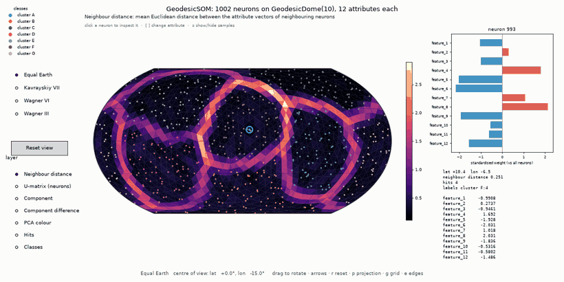
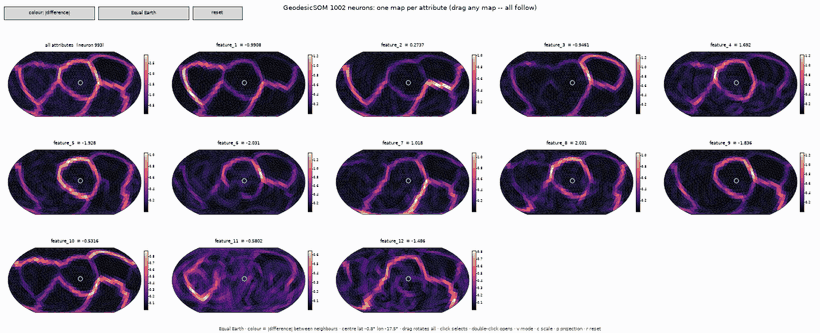
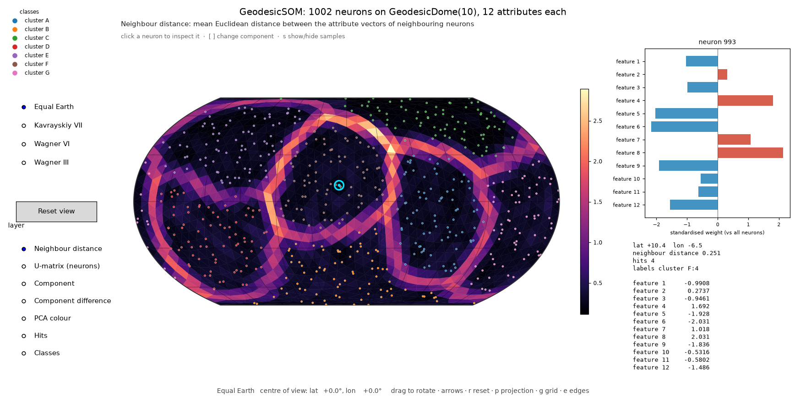
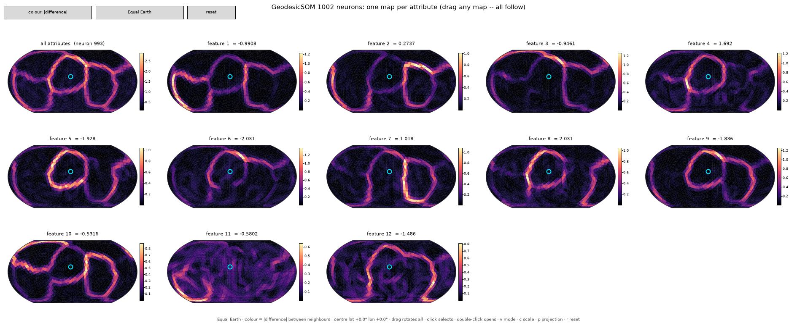
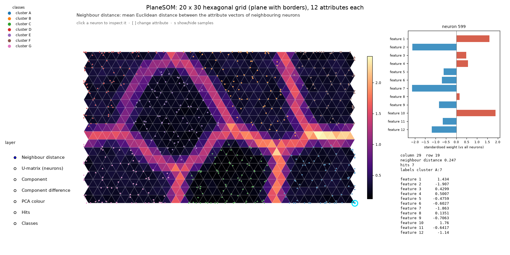
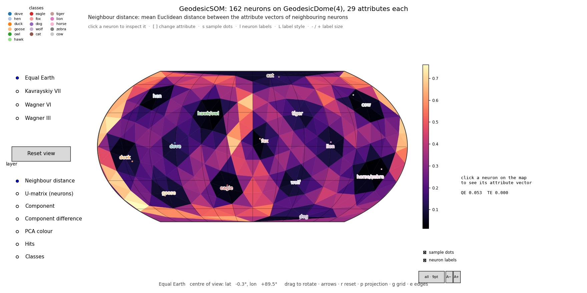

# mtGeodesicSOM — Self-Organising Maps on geodesic domes for Python

[](https://pypi.org/project/mtgeodesicsom/)
[](https://pypi.org/project/mtgeodesicsom/)
[](https://github.com/takatsuka/mtGeodesicSOM/actions/workflows/tests.yml)
[](https://github.com/takatsuka/mtGeodesicSOM/blob/main/LICENSE)

`mt.geodesicsom` provides **Self-Organising Maps (SOMs)** whose neurons live on the lattices of
[mtGeodesicDome](https://github.com/takatsuka/mtGeodesicDome): a **geodesic sphere** (spherical SOM, *GeodesicSOM*) or a
**flat hexagonal/rectilinear grid**, with borders or as a torus.

| What | Name |
|---|---|
| `pip install …` | `mtgeodesicsom` |
| Python import | `mt.geodesicsom` (`mt` is a namespace package shared with `mt.geodesicdome`) |
| Repository | [`takatsuka/mtGeodesicSOM`](https://github.com/takatsuka/mtGeodesicSOM) |
| Lattices | [`mtgeodesicdome`](https://github.com/takatsuka/mtGeodesicDome) (installed automatically) |

**The map view** — the whole attribute vectors on a sphere you rotate with the mouse; click a neuron to see its
attributes. The triangles between neurons are coloured by the Euclidean distance between their attribute vectors:
dark basins are clusters, bright ridges are the borders between them.



**The matrix view** — one map per attribute, coloured by how much that attribute changes between neighbouring
neurons. Drag any map and every map rotates with it.



**What you get**

| Feature | Where |
|---|---|
| Abstract SOM on any `Manifold` lattice (dome, plane or torus) | `mt.geodesicsom.som.SOM` |
| **SOM on a flat hexagonal or rectilinear grid**, with borders or as a torus, trained the same way | `mt.geodesicsom.PlaneSOM.PlaneSOM` |
| Neuron: weight vector on a lattice vertex, with labels and a missing-data-aware distance | `mt.geodesicsom.neuron.Neuron` |
| **Spherical SOM on a geodesic dome**: batch or online training, PCA initialisation, missing values | `mt.geodesicsom.GeodesicSOM.GeodesicSOM` |
| Euclidean distance between neighbouring neurons' attribute vectors (per edge, per triangle, U-matrix) | `edge_distance`, `face_distance`, `u_matrix` |
| **Interactive map of a trained GeodesicSOM**: drag to rotate, click a neuron to see its attributes | `mt.geodesicsom.gui.SOMViewer` |
| **One map per attribute, all at once**, synchronised: drag any map and all rotate together | `mt.geodesicsom.gui.ComponentMatrixViewer` |
| The same two views for a PlaneSOM | `mt.geodesicsom.gui.PlaneSOMViewer`, `PlaneComponentMatrixViewer` |
| Keep any viewers (even in separate windows) rotating and selecting together | `mt.geodesicsom.gui.link_views` |
| **All views in one call** (or `python -m mt.geodesicsom` from a terminal) | `mt.geodesicsom.gui.explore`, `train_and_explore` |
| Demo data, CSV loading, standardisation | `mt.geodesicsom.datasets` |

All interactive code is in the subpackage **`mt.geodesicsom.gui`** (needs matplotlib); everything else needs only
numpy and mtgeodesicdome. The step-by-step guide is in [docs/index.md](https://github.com/takatsuka/mtGeodesicSOM/blob/main/docs/index.md).

---

## 1. Installation

Requires Python ≥ 3.10, NumPy and mtgeodesicdome.

```bash
pip install mtgeodesicsom                  # the library (numpy + mtgeodesicdome)
pip install "mtgeodesicsom[interactive]"   # + matplotlib, for the interactive views (mt.geodesicsom.gui)
pip install "mtgeodesicsom[gpu]"           # + torch, to train on an NVIDIA (CUDA) or Apple Silicon (MPS) GPU
```

Training uses a GPU automatically when torch (with CUDA or MPS) or CuPy is installed, and every CPU core otherwise —
see [GPU and multi-core](#gpu-and-multi-core) below.

Check that it works:

```bash
python -c "from mt.geodesicsom.GeodesicSOM import GeodesicSOM; print(GeodesicSOM(4))"
```

### Working on this repository: `setup_env.sh` (recommended)

```bash
cd mtGeodesicSOM
./setup_env.sh                             # once
python examples/01_plane_som.py       # works straight away, in the same terminal
```

It works like mtGeodesicDome's script (environment in `~/.venvs/mtGeodesicSOM`, outside Google Drive; an activated
shell at the end; auto-activation in new terminals; safe to re-run; the GPU packages this machine can use — torch for
CUDA, Apple Silicon or ROCm, plus CuPy on NVIDIA, skip with `--gpu none`; `--help` for options), with one addition:

* **It uses your local mtGeodesicDome.** If `../mtGeodesicDome` exists next to this repository, it is installed in
  editable mode, so changes to both libraries are picked up at once. Use `--dome PATH` (or `$MTGEODESICDOME_DIR`)
  for another location. Without a checkout, mtgeodesicdome is installed from PyPI.

### Other ways to install

```bash
pip install "git+https://github.com/takatsuka/mtGeodesicSOM.git"   # latest development version
pip install -e ".[dev]"                                            # from a local checkout, editable
```

Optional extras: `interactive` (matplotlib, via mtgeodesicdome), `notebooks` (Jupyter, ipywidgets, ipympl), `dev` (pytest, ruff, build, twine), and `all`.

### Notebooks

Every example is also a Jupyter notebook in
[`examples/notebooks/`](https://github.com/takatsuka/mtGeodesicSOM/tree/main/examples/notebooks), explained step by
step, with controls under every viewer and a "Try it" section to retrain with other settings. With `ipympl` the
viewers are live in the notebook: drag the spheres, click neurons, use the buttons on the figures.

```bash
pip install -e ".[notebooks]"           # setup_env.sh already includes it
jupyter lab examples/notebooks
```

---

## 2. Quick start

### 2.1 Train a GeodesicSOM and visualise it, step by step

**Train.** Every neuron gets a weight vector with one value per attribute of your data.

```python
import numpy as np
from mt.geodesicsom import datasets
from mt.geodesicsom.GeodesicSOM import GeodesicSOM
from mt.geodesicsom.som import InitializationType

# 1. data: an array (samples, attributes); NaN marks a missing value
data, labels, names = datasets.load_sample('clusters') # demo: 7 labelled clusters, 12 attributes
# data, labels, names = datasets.load_sample('wine')                              # other samples: animals, iris, penguins, wine
# data, labels, names = datasets.read_csv('mydata.csv', label_column='species')   # your own data
x = datasets.standardise(data)                        # zero mean, unit variance per attribute

# 2. a spherical SOM on GeodesicDome(10): 10*10**2 + 2 = 1002 neurons, no borders
som = GeodesicSOM(10, seed=0)
som.initialise(InitializationType.Linear, x)          # spread over the first 3 principal components

# 3. train
som.train(x, epochs=30)                               # batch training (mode='online' also works)
print(som)                                            # GeodesicSOM(frequency=10, neurons=1002, dim=12)
print(f'QE {som.quantisation_error(x):.3f}  TE {som.topographic_error(x):.3f}')

# 4. use it
som.weights                                           # (1002, 12): one weight vector per neuron
bmu = som.bmu(x)                                      # the best matching neuron of every sample
hits = som.hits(x)                                    # how many samples each neuron wins
```

**Visualise.** Two interactive views, both built on mtGeodesicDome's rotatable map projections (needs matplotlib):

```python
import matplotlib.pyplot as plt
from mt.geodesicsom.gui import ComponentMatrixViewer, SOMViewer, link_views

# 5. the whole attribute vectors on one rotatable map of the sphere,
#    with each neuron labelled by the samples it is the best matching unit of
viewer = SOMViewer(som, x, labels=labels, feature_names=names, node_labels='majority')

# 6. the matrix view: one map per attribute, all rotating together
matrix = ComponentMatrixViewer(som, names, data=x, labels=labels)

# 7. keep the two windows in step (rotation and selected neuron), then open them
link_views(viewer, matrix)
plt.show()
```

Steps 5–7 in one line: `explore(som, x, labels, names)` (from `mt.geodesicsom.gui`).



**What you see in `SOMViewer`.** The triangles *between* neighbouring neurons are coloured by the Euclidean
distance between their attribute vectors: dark basins are clusters, bright ridges are the borders between them.
Drag to rotate the sphere; click a neuron to see its attribute vector on the right; switch layers on the left
(U-matrix, one attribute's value or difference, PCA colour, hits, classes). With `node_labels`, every neuron that is
the best matching unit of some samples shows their label (majority label, all labels, or labels with counts). Turn
the labels and the sample dots on and off with the check boxes below the colour bar (or `l` and `s`); the style
button next to them (or `L`) switches the label style, and *A−* / *A+* (or `-` / `+`) change the label size.



**What you see in the matrix view (`ComponentMatrixViewer`).** One map per attribute. Each triangle is coloured by
how much *that attribute* changes between its three neurons (mean |w_a[k] − w_b[k]|), so you can see which
attributes form which cluster borders; the first map is the distance over all attributes. Drag any map and every map
rotates; click marks a neuron on every map, with its value of each attribute in the titles; double-click opens that
attribute on its own; `v` switches to the attribute values, `c` to one colour scale for all maps.

**Save images instead of opening windows** (e.g. on a server):

```python
import matplotlib
matplotlib.use('Agg')                                  # before any window is created
from mt.geodesicsom.gui import explore

views = explore(som, x, labels, names, select=int(hits.argmax()), show=False)
views.map.save('som_map.png', dpi=110)
views.matrix.save('som_matrix.png', dpi=90)
```

Complete scripts: `examples/02_geodesicsom_interactive.py` (single map), `examples/03_component_matrix.py`
(matrix view), `examples/04_explore_all.py` (both, linked).

### 2.2 Everything at once, from a terminal

```bash
python -m mt.geodesicsom                                  # demo: 7 labelled clusters, 12 attributes, on a sphere
python -m mt.geodesicsom --data wine                      # a sample shipped with the package: animals, iris, penguins, wine
python -m mt.geodesicsom --data mydata.csv --label-column species
python -m mt.geodesicsom --freq 8 --epochs 50 --projection "Wagner VI"
python -m mt.geodesicsom --only matrix --matrix-mode value
python -m mt.geodesicsom --data iris --node-labels counts --label-size 9   # label neurons with the samples they win
python -m mt.geodesicsom --lattice hexagonal              # a flat 20 x 30 hexagonal grid instead
python -m mt.geodesicsom --save out/som --no-gui          # writes out/som_map.png and out/som_matrix.png
python -m mt.geodesicsom --help
```

This standardises the data, trains, and opens both views, linked. The installed command `mtgeodesicsom` is the same,
and so is `python main.py` in this repository. From Python, `train_and_explore(data, labels, names)` does the same.

### 2.3 Flat SOM (PlaneSOM)

```python
import numpy as np
from mt.geodesicdome.grid.plane import Lattice, Topology
from mt.geodesicsom.PlaneSOM import PlaneSOM
from mt.geodesicsom.gui import explore                     # needs matplotlib

data = np.random.rand(500, 6)                              # 500 samples, 6 attributes

plane = PlaneSOM(row=20, col=30, lattice=Lattice.Hexagonal, topology=Topology.Plane)   # or Topology.Donut: a torus
plane.initialise(dataset=data)                             # linear (PCA) initialisation
plane.train(data, epochs=30)
print(plane.quantisation_error(data), plane.topographic_error(data))

explore(plane, data, feature_names=list('abcdef'))         # PlaneSOMViewer + PlaneComponentMatrixViewer
```



`python examples/01_plane_som.py` does all this with labelled demo data (`--topology torus`, `--lattice rectilinear`,
`--data file.csv`). Each neuron's weight vector is also stored on its lattice vertex (`vertex.data`), so the
neighbourhood searches of mtGeodesicDome (`som.grid.get_neighbours_in_distance(v, d)`) work directly on the map.

### 2.4 Kohonen's animals: a semantic map

```python
from mt.geodesicsom import datasets
from mt.geodesicsom.GeodesicSOM import GeodesicSOM
from mt.geodesicsom.gui import explore

x, animals, names = datasets.animals(symbols=True)    # 16 animals; 16 symbol values + 13 attributes each
som = GeodesicSOM(4, seed=3)                          # 162 neurons
som.initialise(dataset=x)
som.train(x, epochs=60)                               # binary attributes: no standardising
explore(som, x, labels=animals, feature_names=names, node_labels='all', matrix=False)
```



Sixteen animals are described by 13 yes/no attributes (small, medium, big; two legs, four legs, hair, hooves, mane,
feathers; likes to hunt, run, fly, swim) — the data of Ritter & Kohonen's "Self-organizing semantic maps" (1989).
Nothing says which animals are birds, hunters or grazers, yet the trained map puts them in those groups, and the
neuron labels show which animal each neuron stands for. `datasets.load_sample('animals')` gives the 13 attributes
alone. Owl and hawk have the same attributes, and so do horse and zebra; `animals(symbols=True)` sets the data up as
in the paper, adding a small "symbol" part (0.2 for the animal itself) to attribute vectors scaled to unit length.
`python examples/05_kohonen_animals.py` runs it (`--symbols`; `--lattice hexagonal` for the paper's flat 10 × 15 map).

---

## 3. API

### `SOM(grid)` — `mt.geodesicsom.som`

Abstract base class. `grid` is any `mt.geodesicdome` `Manifold` (`GeodesicDome` or `Plane`); subclasses implement
`initialise(type, ...)` and `train()`. `InitializationType` is `Random` or `Linear`.

`GeodesicSOM` and `PlaneSOM` both derive from **`LatticeSOM`** (`mt.geodesicsom.lattice_som`), which holds the
training and every measurement, so the members in the `GeodesicSOM` table below apply to both. Distances between
neurons are measured in neighbour spacings (1 = the distance between neighbouring neurons).

### `PlaneSOM(row, col, dim=None, lattice=Lattice.Hexagonal, topology=Topology.Plane, seed=None, backend=None)` — `mt.geodesicsom.PlaneSOM`

SOM on mtGeodesicDome's `Plane`: `Lattice.Hexagonal` (6 neighbours, odd rows shifted by half a spacing) or
`Lattice.Rectilinear` (4 neighbours); `Topology.Plane` (with borders) or `Topology.Donut` (a torus: no borders, like
the sphere; use an even number of rows with a hexagonal torus). Neuron `i` sits at column `i % col`, row `i // col`.

| Member | Description |
|---|---|
| `row`, `col`, `lattice`, `topology`, `grid` | map size and the underlying `Plane(col, row, lattice, topology)` |
| `positions`, `width`, `height` | `(n, 2)` map coordinates of the neurons (neighbour spacing 1); size of the map |
| `faces` | `(F, 3)` triangles (hexagonal) or `(F, 4)` squares (rectilinear) between neighbouring neurons; none across a torus's wrap |
| everything else | as for `GeodesicSOM`: `initialise` (`Linear` uses the first 2 principal components), `train`, `bmu`, `hits`, `u_matrix`, `edge_distance`, `face_distance`, `face_component_difference`, QE/TE, ... |

### `Neuron(vertex, weights=None, dimension=0)` — `mt.geodesicsom.neuron`

`vertex` · `weights` · `dimension` · `labels` · `distance(other)`: Euclidean distance that skips components
where `other` is missing (`mt.geodesicsom.util.MISSING`, i.e. NaN).

### `GeodesicSOM(grid=8, seed=None, backend=None)` — `mt.geodesicsom.GeodesicSOM`

Spherical SOM whose neurons are the unique points of a `GeodesicDome` (`grid` is a dome or its frequency). Every
neuron has a weight vector with one value per attribute. Distances between neurons are great-circle distances in
*rings* (1 ring = mean spacing between neighbours), so `sigma` means the same at any frequency.

| Member | Description |
|---|---|
| `weights` | `(neurons, attributes)`; after training also on every dome vertex as `vertex.data` (seam copies included) |
| `initialise(type=Linear, dataset=None, dim=None)` | `Linear`: spread over the first 3 principal components by position on the sphere; `Random`: inside the data range |
| `train(data, epochs=20, sigma=None, sigma_end=1.0, mode='batch', learning_rate=(0.5, 0.02), verbose=False)` | `'batch'` or `'online'`; the neighbourhood width shrinks from `sigma` (in neighbour spacings; default a quarter of the largest distance between two neurons) to `sigma_end`; `learning_rate` is used by online mode; returns the SOM |
| `bmu(data, second=False)`, `hits(data)`, `node_labels(data, labels)` | best matching units and what each neuron wins (`node_labels`: `{label: count}` per neuron) |
| `bmu_labels(data, labels, mode='majority', max_per_node=3)` | a text label per neuron from the labels of the samples it is the best matching unit of (`None` if it wins none); `mode`: `'majority'`, `'all'` (`A/B`), `'counts'` (`A×3 B×1`), `'first'` |
| `face_component_difference()`, `face_component_value()` | `(triangles, attributes)`: per attribute, the mean \|difference\| between a triangle's three neurons, or their mean value |
| `edge_distance()`, `face_distance()`, `u_matrix()` | Euclidean distance between neighbouring neurons' weight vectors: per edge, per triangle (mean of its 3 edges), per neuron |
| `quantisation_error(data)`, `topographic_error(data)`, `history` | quality measures; `history` is the QE after each epoch |
| `points`, `faces`, `edges`, `neighbours`, `index_map` | the de-duplicated dome mesh the neurons live on |

Missing values (NaN) are ignored when finding best matching units and when updating weights. Standardise attributes
that are on different scales before training, or the largest ones dominate the Euclidean distance.

#### GPU and multi-core

Best-matching-unit search, `distances`, the error measures and both training modes run on the compute backend of
mtGeodesicDome (`mt.geodesicdome.backend`): an NVIDIA GPU through torch or CuPy, the Apple Silicon GPU through torch
(MPS), otherwise NumPy on every CPU core. The choice is automatic; override it per map or globally:

```python
som = GeodesicSOM(32, backend='cuda')      # or 'mps', 'cupy', 'cpu', 'numpy', 'torch:cpu'; None = automatic
som.to('cpu')                              # move an existing map
print(som.backend)                         # Backend(torch, cuda:0, float32)
```
```bash
MTGEODESIC_BACKEND=cpu python train.py     # default for every map; also MTGEODESIC_NUM_THREADS, MTGEODESIC_DTYPE
```

Distances between neurons are computed on the device when needed rather than stored as a dense matrix, so very large
maps fit in memory (frequency 64, 40 962 neurons, trains in under 1 GB); the matrix is kept whole only when it fits
comfortably, and `node_distance` builds it on first use. The CPU computes in float64 and gives the same results as
before; a GPU uses float32 by default (set `MTGEODESIC_DTYPE=float64` for double precision on CUDA).

### `SOMViewer(som, data=None, labels=None, feature_names=None, ...)` — `mt.geodesicsom.gui`

Built on mtGeodesicDome's `ProjectionViewer`, so the sphere rotates the same way (drag; arrows; `r`, `p`, `g`, `e`).

| Layer | Shows |
|---|---|
| **Neighbour distance** (default) | colour *between* the neurons: each triangle is coloured by the mean Euclidean distance between the attribute vectors of its three neurons. Dark basins are clusters, bright ridges are the borders between them |
| U-matrix (neurons) | the same per neuron: mean distance to its neighbours |
| Component | one attribute (component plane); `[` / `]` or click a bar in the side panel to choose it |
| Component difference | colour *between* the neurons from one attribute: mean \|difference\| of that attribute across each triangle |
| PCA colour | the whole attribute vector as a colour (first three principal components → RGB) |
| Hits / Classes | samples won by each neuron / their majority label (need `data` / `labels`) |

**Click** a neuron to see its attribute vector (standardised against all neurons) with its raw values, hits and labels.
Samples are drawn as dots at their best matching units (`s` hides them). `select_node(i)`, `set_layer(name, component)`
and `save(path)` do the same from code.

**Neuron labels.** `SOMViewer(..., node_labels='majority')` or `viewer.set_node_labels(mode, sample_names=None)` writes,
on every neuron that is the best matching unit of at least one sample, the label(s) of those samples: `'majority'`,
`'all'`, `'counts'` or `'first'` (see `bmu_labels`), coloured by class; `None` removes them. By default the text comes
from `labels`; pass `sample_names` (any text per sample, e.g. names or IDs) to label neurons with those instead. The
labels rotate with the sphere. **On and off:** the *neuron labels* check box below the colour bar, the `l` key, or
`viewer.show_node_labels(True/False)` / `toggle_node_labels()`, which keep the style; the *labels:* button, `L` or
`set_node_labels(style)` change the style (majority → all → counts). **Size:** the *A−* / *A+* buttons, `-` / `+`,
`viewer.set_label_size(points)`, or `label_size=` when opening the viewer (default 7 pt, kept between 3 and 30); the
labels are resized in place. The *sample dots* check box, `s` or `set_show_samples(on)` do the same for the sample
dots. `PlaneSOMViewer` has the same.

### `ComponentMatrixViewer(som, feature_names=None, mode='difference', ...)` — `mt.geodesicsom.gui`

A grid with one rotatable map per attribute (plus, first, the Euclidean distance over all attributes). In the default
`'difference'` mode each triangle between three neighbouring neurons is coloured by how much *that attribute* changes
between them, so you can see which attributes make which cluster borders; `'value'` shows the attribute itself.

| Mouse / key | Action |
|---|---|
| drag in any map | rotate the sphere in **every** map |
| click | mark that neuron on every map; its value of each attribute appears in the map titles |
| double-click | open that attribute in a full `SOMViewer` (layer *Component difference*), rotation linked to the grid |
| `v` / button | switch between \|difference\| and value |
| `c` | one colour scale for all maps ↔ one per map |
| arrows, `,` `.`, `r`, `p`, `g`, `e` | rotate, roll, reset, projection, graticule, edges |

Options: `include_total`, `shared_scale`, `ncols`, `projection`, `view`, and `data`/`labels` (passed to the viewers a
double-click opens). Methods: `rotate`, `set_view`, `set_rotation`, `set_mode`, `set_shared_scale`, `select_node`,
`open_single(k)`, `on_rotate`, `save`, `show`.

A drag frame redraws every map. At frequency 10 (1 002 neurons) with 13 maps a frame takes about 0.15 s,
so use a lower frequency for smoother rotation with many attributes.

### `PlaneSOMViewer(som, data=None, labels=None, feature_names=None, ...)`, `PlaneComponentMatrixViewer(som, ...)` — `mt.geodesicsom.gui`

The two views for a `PlaneSOM`, with the same layers, inspector, keys and options as `SOMViewer` and
`ComponentMatrixViewer` (there is nothing to rotate). The faces between neurons are triangles on a hexagonal grid and
squares on a rectilinear one; `e` shows their edges. In the matrix, click marks a neuron on every map and
double-click opens one attribute in a `PlaneSOMViewer`, selection linked.

### `explore(som, data=None, labels=None, feature_names=None, ...)` — `mt.geodesicsom.gui`

Opens the two views that suit the SOM (`SOMViewer` + `ComponentMatrixViewer` for a `GeodesicSOM`, `PlaneSOMViewer` +
`PlaneComponentMatrixViewer` for a `PlaneSOM`), linked, and returns `Views(map, matrix)`. Options: `single`, `matrix`
(which views), `link`, `layer`, `matrix_mode`, `projection`, `view`, `select` (a neuron to select), `node_labels` and
`sample_names` and `label_size` (neuron labels on the single map), `show=False`
(build without opening windows, e.g. to `save`).
`train_and_explore(data, labels, feature_names, lattice='sphere', frequency=10, rows=20, cols=30, topology='plane',
epochs=30, standardise=True, ...)` trains first and returns `(som, views)`. `python -m mt.geodesicsom` /
`mtgeodesicsom` is the command-line version (`--help` for its options).

### `datasets` — `mt.geodesicsom.datasets`

Sample data shipped with the package (CSV files in `mt/geodesicsom/data`):

| name | samples × attributes | labels | source |
|---|---|---|---|
| `animals` | 16 × 13 (binary) | one per animal | Ritter & Kohonen (1989) |
| `clusters` | 560 × 12 | 7 clusters | synthetic (the same as `clusters()`) |
| `iris` | 150 × 4 | 3 species | Fisher (1936), public domain |
| `penguins` | 342 × 4 | 3 species | Palmer penguins (Gorman et al. 2014), CC0 |
| `wine` | 178 × 13 | 3 cultivars | UCI Wine, CC BY 4.0 |

`load_sample(name)` loads one, `samples()` lists them, `sample_path(name)` gives the CSV file's path, and
`load(name_or_path, label_column=None)` accepts a sample name, `'colours'` or a CSV path (as `--data` does). Sources,
citations and licences are in [`data/README.md`](https://github.com/takatsuka/mtGeodesicSOM/blob/main/src/mt/geodesicsom/data/README.md).

`animals(symbols=False, symbol_weight=0.2)` loads the animals, with `symbols=True` set up as Ritter & Kohonen's
semantic map. `clusters(n_clusters=7, dim=12, per_cluster=80, seed=3)` (labelled Gaussian clusters) and `colours()`
(random RGB) generate data; `read_csv(path, label_column=None)` reads your own (numeric columns become attributes, empty cells and
`NA` are missing values). All return `Dataset(data, labels, feature_names)`; `standardise(x)` gives every attribute
zero mean and unit variance.

### `link_views(*viewers, rotation=True, selection=True)` — `mt.geodesicsom.gui`

Keeps viewers in step, in the same or separate windows: turning one turns the others (`SOMViewer`,
`ComponentMatrixViewer`, mtGeodesicDome's `ProjectionViewer`), and selecting a neuron in one selects it in the others
(all four SOM viewers).

```python
from mt.geodesicsom.gui import SOMViewer, link_views

a = SOMViewer(som, x, layer='Component difference', component=0)   # som: the trained GeodesicSOM of section 2.1
b = SOMViewer(som, x, layer='Component difference', component=1)
link_views(a, b)
```

---

## 4. Changelog

See [CHANGELOG.md](https://github.com/takatsuka/mtGeodesicSOM/blob/main/CHANGELOG.md).

---

## 5. Citing

If you use mtGeodesicSOM in research, please cite:

> Y. Wu and M. Takatsuka, "Spherical self-organizing map using efficient indexed geodesic data structure,"
> *Neural Networks*, vol. 19, no. 6–7, pp. 900–910, 2006. [doi:10.1016/j.neunet.2006.05.021](https://doi.org/10.1016/j.neunet.2006.05.021)

```bibtex
@article{wu2006spherical,
  author  = {Wu, Yingxin and Takatsuka, Masahiro},
  title   = {Spherical self-organizing map using efficient indexed geodesic data structure},
  journal = {Neural Networks},
  volume  = {19},
  number  = {6--7},
  pages   = {900--910},
  year    = {2006},
  month   = {07},
  doi     = {10.1016/j.neunet.2006.05.021}
}
```

The repository's `CITATION.cff` also lets GitHub's "Cite this repository" button produce a reference to
the software itself.

---

## 6. Licence

Copyright © 2022–2026 Masahiro Takatsuka.

mtGeodesicSOM is free software under the **GNU Affero General Public License v3.0 or later**
([LICENSE](https://github.com/takatsuka/mtGeodesicSOM/blob/main/LICENSE)), with an additional attribution term
([NOTICE](https://github.com/takatsuka/mtGeodesicSOM/blob/main/NOTICE)). In short:

* **You may** use, study, modify and share it, including commercially.
* **If you distribute it,** or a modified version, or software that includes it, **or let people use a
  modified version over a network,** you must release the complete source code of that work under the
  same licence.
* **You must keep the attribution** to the author and to the 2006 paper, both in the source code and in
  the legal notices your software displays.
* There is no warranty.

**Commercial licence.** To use mtGeodesicSOM in proprietary software without these obligations, contact
<masa@takatsuka.org> about a commercial licence.

**Contributing.** Contributions are welcome under the terms in
[CONTRIBUTING.md](https://github.com/takatsuka/mtGeodesicSOM/blob/main/CONTRIBUTING.md).
