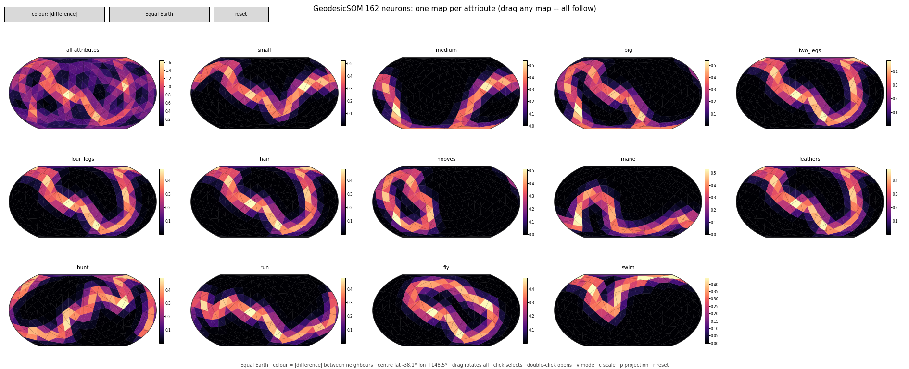

# mtGeodesicSOM user guide

`mt.geodesicsom` trains **Self-Organising Maps (SOMs)** whose neurons live on the lattices of
[mtGeodesicDome](https://github.com/takatsuka/mtGeodesicDome): a **geodesic sphere** (`GeodesicSOM`, a spherical SOM
with no borders) or a **flat hexagonal/rectilinear grid**, with borders or as a torus (`PlaneSOM`). The subpackage
`mt.geodesicsom.gui` explores a trained map interactively: one rotatable map of the whole attribute vectors, and a
matrix view with one map per attribute.

| What | Name |
|---|---|
| `pip install …` | `mtgeodesicsom` (`"mtgeodesicsom[interactive]"` for the views) |
| Python import | `mt.geodesicsom` |
| Source | [github.com/takatsuka/mtGeodesicSOM](https://github.com/takatsuka/mtGeodesicSOM) |


**Contents**

1. [Installation](#1-installation)
2. [Training a GeodesicSOM](#2-training-a-geodesicsom) — data, creating the map, initialising, training, checking, using
3. [Visualising a GeodesicSOM](#3-visualising-a-geodesicsom) — the map view, the matrix view, both together, saving images
4. [The command line](#4-the-command-line)
5. [Flat maps: PlaneSOM](#5-flat-maps-planesom)
6. [Example: Kohonen's animals](#6-example-kohonens-animals) — a semantic map
7. [How it works](#7-how-it-works)
8. [Citing and licence](#8-citing-and-licence)

The [README](../README.md) has the API reference; development set-up is in the README and
[CONTRIBUTING.md](../CONTRIBUTING.md), and release notes in [CHANGELOG.md](../CHANGELOG.md).

---

## 1. Installation

Requires Python ≥ 3.10.

```bash
pip install mtgeodesicsom                   # training: numpy + mtgeodesicdome
pip install "mtgeodesicsom[interactive]"    # + matplotlib, for the interactive views
pip install "mtgeodesicsom[gpu]"            # + torch, to train on an NVIDIA (CUDA) or Apple Silicon (MPS) GPU
```

Working on this repository: `./setup_env.sh` creates `~/.venvs/mtGeodesicSOM` with everything, including your local
`../mtGeodesicDome` in editable mode (see the README).

---

## 2. Training a GeodesicSOM

The whole recipe:

```python
from mt.geodesicsom import datasets
from mt.geodesicsom.GeodesicSOM import GeodesicSOM
from mt.geodesicsom.som import InitializationType

data, labels, names = datasets.load_sample('wine')   # or datasets.read_csv('mydata.csv', label_column='species')
x = datasets.standardise(data)

som = GeodesicSOM(10, seed=0)                          # 1002 neurons
som.initialise(InitializationType.Linear, x)
som.train(x, epochs=30)
print(f'QE {som.quantisation_error(x):.3f}  TE {som.topographic_error(x):.3f}')
```

The steps in detail:

### 2.1 Prepare the data

The data is a NumPy array of shape `(samples, attributes)`. Every neuron will hold a weight vector with one value per
attribute. `NaN` marks a missing value; it is ignored when finding a sample's best matching neuron and when updating
the weights.

```python
from mt.geodesicsom import datasets

ds = datasets.read_csv('mydata.csv', label_column='species')   # numeric columns -> attributes, empty cells -> NaN
data, labels, names = ds                                       # labels: array or None; names: attribute names
x = datasets.standardise(data)                                 # zero mean, unit variance per attribute
```

**Standardise** attributes that are on different scales: the SOM compares weight vectors with the Euclidean distance,
so an attribute measured in thousands would otherwise swamp one measured in fractions. Skip it if all attributes share
a meaningful scale (e.g. RGB colours in [0, 1]).

**Sample data** ships with the package, so you can try everything without data of your own:

```python
datasets.samples()                        # {'animals': ..., 'clusters': ..., 'iris': ..., 'penguins': ..., 'wine': ...}
penguins = datasets.load_sample('penguins')   # penguins.data (342, 4), penguins.labels, penguins.feature_names
datasets.sample_path('iris')              # the CSV file itself
```

| name | samples × attributes | labels | source |
|---|---|---|---|
| `animals` | 16 × 13 (binary) | one per animal | Kohonen's animals (Ritter & Kohonen 1989); see section 6 |
| `clusters` | 560 × 12 | 7 clusters (A–G) | synthetic Gaussian clusters, the same as `datasets.clusters()` |
| `iris` | 150 × 4 | 3 species | R. A. Fisher (1936), public domain |
| `penguins` | 342 × 4 | 3 species | Palmer penguins (Gorman, Williams & Fraser 2014; Horst, Hill & Gorman 2020), CC0 |
| `wine` | 178 × 13 | 3 cultivars | UCI Wine (Aeberhard & Forina 1991), CC BY 4.0 — credit required |

Sources, citations and licences are in `mt/geodesicsom/data/README.md`; the data sets are not covered by the
package's AGPL licence. `datasets.clusters(n_clusters, dim, per_cluster, seed)` generates clusters of any size and
`datasets.colours()` random RGB colours.

### 2.2 Create the map

```python
from mt.geodesicsom.GeodesicSOM import GeodesicSOM

som = GeodesicSOM(10, seed=0)          # the frequency of the geodesic dome, or a GeodesicDome instance
```

The neurons are the points of a geodesic dome of frequency *f*: 10*f*² + 2 of them, evenly spread over the sphere.
Every neuron has 6 neighbours (5 at the 12 corners of the original icosahedron), and there is no border, so no neuron
is at a disadvantage.

| frequency *f* | neurons | a sensible range of samples |
|---:|---:|---|
| 4 | 162 | up to a few hundred |
| 6 | 362 | hundreds |
| 8 | 642 | hundreds to a few thousand |
| 10 | 1 002 | thousands |
| 12 | 1 442 | thousands |
| 16 | 2 562 | many thousands |

Training compares every neuron with every other neuron, so memory and time grow with the square of the number of
neurons: frequency 16 needs about 26 MB for that table, frequency 24 (5 762 neurons) about 130 MB. `seed` makes random
initialisation and online training reproducible.

### 2.3 Initialise the weights

```python
from mt.geodesicsom.som import InitializationType

som.initialise(InitializationType.Linear, x)     # recommended
som.initialise(InitializationType.Random, x)     # uniform inside each attribute's [min, max]
```

**Linear** initialisation spreads the weights over the first three principal components of the data, placed by each
neuron's position on the sphere, so the map starts already roughly ordered and trains faster and more reproducibly.
If you call `train` without initialising, it uses linear initialisation.

### 2.4 Train

```python
som.train(x, epochs=30)                                    # batch training
som.train(x, epochs=10, mode='online')                     # classic sample-by-sample updates
som.train(x, epochs=50, sigma=8, sigma_end=0.5, verbose=True)
```

| parameter | meaning |
|---|---|
| `epochs` (20) | passes over the data |
| `mode` (`'batch'`) | `'batch'`: each epoch sets every neuron to the neighbourhood-weighted mean of the samples — fast and deterministic. `'online'`: one sample at a time, with a decaying `learning_rate` |
| `sigma` | starting neighbourhood width, in *rings* (1 ring = the spacing between neighbouring neurons); default a quarter of the largest distance between two neurons, i.e. a quarter of the way round the sphere |
| `sigma_end` (1.0) | final neighbourhood width; it shrinks geometrically from `sigma` over the epochs |
| `learning_rate` (`(0.5, 0.02)`) | start and end learning rate, online mode only |
| `verbose` | print the quantisation error after every epoch |

The neighbourhood is Gaussian in the great-circle distance between neurons. A wide neighbourhood at the start orders
the map globally; a narrow one at the end fits it to the details. Measuring `sigma` in rings means the same value works
at any frequency. `train` returns the SOM, so `GeodesicSOM(8).train(x)` works too.

**GPU and multi-core.** Training and every query (`bmu`, `distances`, `hits`, the error measures) run on a GPU when one
is available — NVIDIA through torch or CuPy, Apple Silicon through torch (MPS) — and on every CPU core otherwise. Pick
a device with `GeodesicSOM(16, backend='cuda')` (`'mps'`, `'cupy'`, `'cpu'`, `'numpy'`), move a map with
`som.to('cpu')`, or set `MTGEODESIC_BACKEND` for the whole program; `print(som.backend)` shows what is used. A GPU
computes in float32 by default (`MTGEODESIC_DTYPE=float64` for double precision on CUDA); the CPU uses float64.

### 2.5 Check the result

```python
som.quantisation_error(x)     # mean distance from each sample to its best matching neuron: lower = closer fit
som.topographic_error(x)      # fraction of samples whose two best neurons are not neighbours: lower = better ordered
som.history                   # the quantisation error after each epoch
```

A good map has a low quantisation error *and* a topographic error close to 0. If the topographic error is high, train
longer or start with a wider `sigma`; if the quantisation error stays high, use a higher frequency or a smaller
`sigma_end`.

### 2.6 Use the trained map

```python
som.weights                       # (neurons, attributes): the weight vector of every neuron
som.bmu(x)                        # best matching neuron of every sample; bmu(x, second=True) gives the best two
som.hits(x)                       # how many samples each neuron wins
som.node_labels(x, labels)        # per neuron, {label: count} of the samples it wins
som.bmu_labels(x, labels)         # per neuron, the majority label of the samples it wins (None if none);
                                  # mode='all' ('A/B'), 'counts' ('A×3 B×1') or 'first'
som.points                        # (neurons, 3): each neuron's position on the unit sphere
som.neighbours[0]                 # the neighbours of neuron 0
som.edge_distance()               # Euclidean distance between the weight vectors of each pair of neighbours
som.face_distance()               # ... averaged over each triangle of three neighbouring neurons
som.face_component_difference()   # (triangles, attributes): the same, one attribute at a time
som.u_matrix()                    # per neuron: mean distance to its neighbours' weight vectors
```

After training, every vertex of the underlying `GeodesicDome` (`som.dome`) also carries its neuron's weight vector as
`vertex.data`, so mtGeodesicDome's own tools work on the trained map too.

---

## 3. Visualising a GeodesicSOM

The views need matplotlib (`pip install "mtgeodesicsom[interactive]"`) and a desktop: a window opens from a
terminal or an IDE. In Jupyter, run `%matplotlib widget` first (`pip install ipympl`).

### 3.1 The map view: `SOMViewer`

```python
from mt.geodesicsom.gui import SOMViewer

viewer = SOMViewer(som, x, labels=labels, feature_names=names)
viewer.show()
```

`data` (here `x`), `labels` and `feature_names` are optional; `data` adds the hits layer and the sample dots, `labels`
the class layer and coloured dots.

The sphere is drawn in a map projection that you rotate with the mouse. The default layer, **Neighbour distance**,
colours every triangle between three neighbouring neurons by the mean Euclidean distance between their attribute
vectors: **dark basins are clusters, bright ridges are the borders between clusters.**

| Layer | Shows |
|---|---|
| Neighbour distance | the distance between neighbouring neurons' whole attribute vectors, drawn between the neurons |
| U-matrix (neurons) | the same, per neuron (mean distance to its neighbours) |
| Component | one attribute's value (a component plane) |
| Component difference | how much one attribute changes between neighbouring neurons |
| PCA colour | the whole attribute vector as a colour (first three principal components → RGB) |
| Hits | how many samples each neuron wins (needs `data`) |
| Classes | the majority label of the samples each neuron wins (needs `labels`) |

| Mouse / key | Action |
|---|---|
| drag | rotate the sphere |
| click | inspect the neuron under the pointer: its attribute vector (standardised bars and raw values), hits, labels |
| click a bar in the side panel | show that attribute (Component layers) |
| `[` / `]` | previous / next attribute |
| `l` / *neuron labels* check box | neuron labels on / off (the style is kept) |
| `L` / *labels:* button | next label style: majority → all → counts (→ first, with `sample_names`) |
| `s` / *sample dots* check box | sample dots on / off |
| `-` / `+` (or `=`), *A−* / *A+* buttons | smaller / larger neuron labels |
| arrows (shift: finer), `,` `.` | rotate, roll |
| `r`, `p`, `g`, `e` | reset the view, next projection, graticule, triangle edges |

**Neuron labels.** To see which samples each neuron represents, write their labels on the map:

```python
viewer = SOMViewer(som, x, labels=labels, feature_names=names, node_labels='majority')
viewer.set_node_labels('counts')                       # 'setosa×3 versicolor×1'
viewer.set_node_labels('all')                          # 'setosa/versicolor'
ids = [f'#{i}' for i in range(len(x))]
viewer.set_node_labels('first', sample_names=ids)      # your own text per sample, e.g. names or IDs
viewer.set_node_labels(None)                           # off
```

Every neuron that is the best matching unit of at least one sample gets a label, coloured by its majority class, and
the labels rotate with the sphere.

**Turning them on and off, style and size.** Below the colour bar are two check boxes, *sample dots* and *neuron
labels*, a style button showing the current style and size (e.g. *majority · 7pt*), and *A−* / *A+*. Tick or untick
*neuron labels* (or press `l`) to show or hide the labels; the style is kept. Click the style button (or press `L`)
for the next style, and *A−* / *A+* (or `-` / `+`) to make the labels smaller or larger. From code:

```python
viewer.show_node_labels(False)      # off
viewer.show_node_labels(True)       # on again, same style
viewer.toggle_node_labels()         # on <-> off
viewer.set_label_size(10)           # label size in points (default 7, kept between 3 and 30)
viewer.set_show_samples(False)      # hide the sample dots
```

`label_size=` sets the size when you open the viewer (also in `explore()`, and `--label-size` on the command line).
`max_per_node` (default 3) limits the labels per neuron in `'all'`/`'counts'` mode. On a large, busy map, `'majority'`
or a smaller size keeps the labels readable.

The same from code: `viewer.set_layer('Component difference', component=3)`, `viewer.select_node(i)`,
`viewer.set_view(lat, lon)`, `viewer.rotate(d_lon=30)`, `viewer.set_projection('Wagner VI')`, `viewer.save('map.png')`.
Constructor options: `layer`, `component`, `show_samples`, `node_labels`, `sample_names`, `projection` (`'Equal Earth'`, `'Kavrayskiy VII'`,
`'Wagner VI'`, `'Wagner III'`), `view` (the `(lat, lon)` at the centre), `graticule`, `edges`, `figsize`, `title`.

### 3.2 The matrix view: `ComponentMatrixViewer`

```python
from mt.geodesicsom.gui import ComponentMatrixViewer

matrix = ComponentMatrixViewer(som, names, data=x, labels=labels)
matrix.show()
```


One map per attribute, in a grid, all showing the sphere in the same orientation. In the default **difference** mode,
each triangle between three neighbouring neurons *a*, *b*, *c* is coloured by how much attribute *k* changes between
them:

  (|w<sub>a</sub>[k] − w<sub>b</sub>[k]| + |w<sub>b</sub>[k] − w<sub>c</sub>[k]| + |w<sub>c</sub>[k] − w<sub>a</sub>[k]|) / 3

Bright lines on map *k* show where attribute *k* changes sharply. Comparing the maps shows which attributes form which
cluster borders. The first map, *all attributes*, is the Euclidean distance over the whole attribute vector, as in the
map view.

| Mouse / key | Action |
|---|---|
| drag in any map | rotate the sphere — **every map follows** |
| click | mark that neuron on every map; the titles show its value of each attribute |
| double-click | open that attribute in a full `SOMViewer` (layer *Component difference*), rotation and selection linked |
| `v` / *colour* button | switch between \|difference\| and the attribute value (component planes) |
| `c` | one colour scale for all maps ↔ one per map |
| arrows, `,` `.`, `r`, `p`, `g`, `e` | rotate, roll, reset, projection, graticule, edges |

Options: `mode='value'`, `shared_scale=True`, `include_total=False` (leave out the *all attributes* map), `ncols`,
`projection`, `view`. Methods: `set_mode`, `set_shared_scale`, `select_node`, `rotate`, `set_view`, `open_single(k)`,
`save`. Every drag step redraws every map: with 13 maps of 1 002 neurons a step takes about 0.15 s, so use a lower
frequency if rotation feels slow with many attributes.

### 3.3 Both together, linked

```python
from mt.geodesicsom.gui import explore

views = explore(som, x, labels, names)     # opens views.map (SOMViewer) and views.matrix (ComponentMatrixViewer)
```

The two windows are linked: rotating either rotates the other, and selecting a neuron in one selects it in the other.
To link viewers yourself (including mtGeodesicDome's `ProjectionViewer`):

```python
import matplotlib.pyplot as plt
from mt.geodesicsom.gui import ComponentMatrixViewer, SOMViewer, link_views

viewer = SOMViewer(som, x, labels=labels, feature_names=names)
matrix = ComponentMatrixViewer(som, names, data=x, labels=labels)
link_views(viewer, matrix)                  # rotation=True, selection=True
plt.show()
```

`train_and_explore(data, labels, names, frequency=10, epochs=30)` standardises the data, trains a GeodesicSOM and
calls `explore`, returning `(som, views)`.

### 3.4 Saving images

Build the views without opening windows and save them:

```python
import matplotlib
matplotlib.use('Agg')                       # before any window is created, e.g. on a server
from mt.geodesicsom.gui import explore

views = explore(som, x, labels, names, show=False, select=int(som.hits(x).argmax()))
views.map.set_view(-20, 60)                 # choose the orientation (both views follow)
views.map.save('som_map.png', dpi=110)
views.matrix.save('som_matrix.png', dpi=90)
```

---

## 4. The command line

`python -m mt.geodesicsom` (or the installed `mtgeodesicsom`, or `python main.py` in the repository) loads data,
standardises it, trains a SOM and opens both views, linked:

```bash
python -m mt.geodesicsom                                   # demo data on a sphere
python -m mt.geodesicsom --data wine                       # a sample: animals, clusters, iris, penguins, wine
python -m mt.geodesicsom --data mydata.csv --label-column species
python -m mt.geodesicsom --freq 12 --epochs 50 --mode online
python -m mt.geodesicsom --projection "Kavrayskiy VII" --only matrix --matrix-mode value
python -m mt.geodesicsom --save results/som --no-gui       # results/som_map.png, results/som_matrix.png
```

| option | meaning |
|---|---|
| `--data` | a sample (`clusters` — the default —, `animals`, `iris`, `penguins`, `wine`), `colours` (random RGB), or a CSV file with a header row |
| `--label-column` | the CSV column with class labels |
| `--freq`, `--epochs`, `--mode` | dome frequency (10), epochs (30), `batch` or `online` |
| `--no-standardise` | train on the raw attribute values |
| `--projection` | `Equal Earth`, `Kavrayskiy VII`, `Wagner VI`, `Wagner III` |
| `--only map\|matrix`, `--matrix-mode`, `--no-link` | which views, and how |
| `--node-labels majority\|all\|counts` | label the neurons on the map with the samples they win |
| `--label-size POINTS` | the size of those labels (default 7) |
| `--save PREFIX`, `--no-gui` | save `PREFIX_map.png` and `PREFIX_matrix.png`; do not open windows |
| `--lattice`, `--rows`, `--cols`, `--topology` | a flat PlaneSOM instead (section 5) |

---

## 5. Flat maps: PlaneSOM

`PlaneSOM` trains and measures exactly like `GeodesicSOM` (both derive from `LatticeSOM`), on mtGeodesicDome's flat
`Plane`:

```python
from mt.geodesicdome.grid.plane import Lattice, Topology
from mt.geodesicsom.PlaneSOM import PlaneSOM
from mt.geodesicsom.gui import explore

som = PlaneSOM(row=20, col=30, lattice=Lattice.Hexagonal, topology=Topology.Plane)   # Topology.Donut: a torus
som.initialise(dataset=x)                  # linear: the first two principal components
som.train(x, epochs=30)
explore(som, x, labels, names)             # PlaneSOMViewer + PlaneComponentMatrixViewer, selection linked
```


A hexagonal grid gives every neuron 6 neighbours, a rectilinear one 4. With `Topology.Donut` the map wraps around at
its edges, so, like the sphere, it has no border (use an even number of rows with a hexagonal torus). The views have
the same layers, inspector and keys as the spherical ones, without rotation. See `examples/01_plane_som.py` or run
`python -m mt.geodesicsom --lattice hexagonal`.

---

## 6. Example: Kohonen's animals

The classic demonstration that a SOM finds categories nobody told it about.

```python
from mt.geodesicsom import datasets
from mt.geodesicsom.GeodesicSOM import GeodesicSOM
from mt.geodesicsom.gui import explore

x, animals, names = datasets.animals(symbols=True)    # 16 animals; 16 symbol values + 13 attributes each
som = GeodesicSOM(4, seed=3)                          # 162 neurons
som.initialise(dataset=x)
som.train(x, epochs=60)                               # binary attributes: no standardising
explore(som, x, labels=animals, feature_names=names, node_labels='all', matrix=False)
```


Sixteen animals are described by 13 yes/no attributes (small, medium, big; two legs, four legs, hair, hooves, mane,
feathers; likes to hunt, run, fly, swim) — the data of Ritter & Kohonen's "Self-organizing semantic maps" (1989).
Nothing says which animals are birds, hunters or grazers, yet the trained map puts them in those groups, and the
neuron labels show which animal each neuron stands for. `datasets.load_sample('animals')` gives the 13 attributes
alone. Owl and hawk have the same attributes, and so do horse and zebra; `animals(symbols=True)` sets the data up as
in the paper, adding a small "symbol" part (0.2 for the animal itself) to attribute vectors scaled to unit length.
`python examples/05_kohonen_animals.py` runs it (`--symbols`; `--lattice hexagonal` for the paper's flat 10 × 15 map).

With the 13 attributes alone (`python examples/05_kohonen_animals.py`) the component matrix is worth a look: each
attribute's map is dark inside the regions where it does not change and bright along their borders, so `feathers`,
`two_legs` and `four_legs` all trace the same bird/mammal border, `hooves` rings the horse, zebra and cow, and `swim`
the duck and goose.



Source: H. Ritter and T. Kohonen, "Self-organizing semantic maps", *Biological Cybernetics* 61(4):241–254, 1989. doi:10.1007/BF00203171

---

## 7. How it works

* **One implementation, several lattices.** `LatticeSOM` holds the training and all measurements. A lattice supplies
  its faces, the distances between its neurons (in neighbour spacings: great-circle distance on the sphere, grid
  distance on a plane, wrapping round on a torus) and coordinates for linear initialisation.
* **Neurons on the dome.** mtGeodesicDome stores points on the seams of its unfolded net more than once;
  `GeodesicSOM` uses each *unique* point once as a neuron (`som.index_map` maps stored vertices to neurons) and, after
  training, writes the weights back to every stored copy (`vertex.data`).
* **Colour between neurons.** The views colour the faces between neurons (triangles on the sphere and on a hexagonal
  grid, squares on a rectilinear grid) by the distance between the neurons' weight vectors: over all attributes
  (`face_distance()`, a U-matrix drawn between the neurons rather than on them) or per attribute
  (`face_component_difference()`).
* **Batch training.** Each epoch assigns every sample to its best matching neuron, then sets every neuron to the
  mean of all samples weighted by a Gaussian of the distance between their neurons; missing values are left out of
  both steps.
* **On the GPU or all CPU cores.** The work is cut into blocks sized to the device's memory. Samples are centred on
  the mean weight vector before |x − w|² = |x|² − 2x·w + |w|² is evaluated, so float32 on a GPU stays accurate. The
  neighbourhood matrix is never stored for large maps: each block of rows of H is formed from the neuron positions on
  the device and multiplied straight away. On the CPU, blocks run on a thread pool and the matrix products use BLAS
  on every core.
* **The views.** `SOMViewer` and `ComponentMatrixViewer` use mtGeodesicDome's `SphereMap`, which projects a rotated
  sphere correctly across the ±180° meridian and at the poles, so every rotation shows a complete map.

---

## 8. Citing and licence

If you use mtGeodesicSOM in research, please cite the paper that introduced the spherical SOM on the indexed geodesic
data structure:

> Y. Wu and M. Takatsuka, "Spherical self-organizing map using efficient indexed geodesic data structure,"
> *Neural Networks*, vol. 19, no. 6–7, pp. 900–910, 2006. [doi:10.1016/j.neunet.2006.05.021](https://doi.org/10.1016/j.neunet.2006.05.021)

GitHub's *Cite this repository* button (from [`CITATION.cff`](../CITATION.cff)) gives a reference to the software
itself.

mtGeodesicSOM is free software under the **GNU Affero General Public License v3.0 or later** ([LICENSE](../LICENSE)),
with an additional attribution term ([NOTICE](../NOTICE)): you may use, study, modify and share it; if you distribute
it or software that includes it, or let people use a modified version over a network, you must release the complete
source under the same licence and keep the attribution. A commercial licence is available from
<masa@takatsuka.org>.
